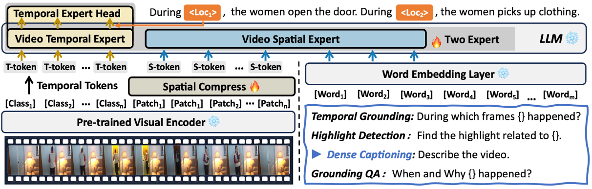
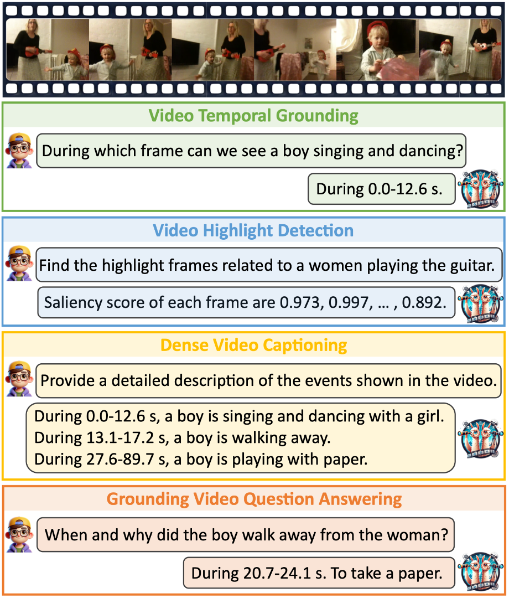

# VideoExpert: Augmented LLM for Temporal-Sensitive Video Understanding 

## VideoExpert Overview

VideoExpert is a Video LLM designed for Temporal-Sensitive Video Understanding, including video temporal grounding, video highlight detection, dense video captioning and video grounding question answering.



---

## Contributions

- A key failure mode in MLLM-based timestamp prediction is identified - text-pattern bias arising when timestamps are generated in textual form. This insight motivates us to develop a general-purpose MLLM, VideoExpert, which is more suitable for several temporal-sensitive video tasks.
- VideoExpert integrates two parallel modules: the Temporal Expert for temporal perception and the Spatial Expert for content generation. Each expert focuses on specific task types, eliminating reliance on text pattern biases in timestamp predictions.
- A Spatial Compress module is proposed to filter and compress large-scale patch tokens while preserving key information. This module supplies the Spatial Expert with compact, detail-rich inputs to enhance its detailed perception capability.
- Extensive experiments conducted on four challenging datasets across four tasks, i.e. Charades-STA, QVHighlights, YouCookII and Next-GQA, demonstrate the effectiveness of the proposed method.


---

## Installation

We recommend setting up a conda environment for the project:
```shell
conda create --name=videoexpert python=3.10
conda activate videoexpert

git clone https://github.com/coffeecolamind/VideoExpert.git
cd videoexpert
pip install -r requirements.txt
```
Additionally, install additional packages for training cases.
```shell
pip install ninja
pip install flash-attn --no-build-isolation
```


## Training :train:

For training instructions, check out [train.md](docs/train.md).

## Qualitative Analysis :mag:

A Comprehensive Evaluation of VideoExpert's Performance across Multiple Tasks.


 

---


## Acknowledgements :pray:

We are grateful for the following awesome projects our VideoExpert arising from:

* [VTimeLLM](https://github.com/huangb23/VTimeLLM): Empower LLM to Grasp Video Moments
* [LLaVA](https://github.com/haotian-liu/LLaVA): Large Language and Vision Assistant
* [FastChat](https://github.com/lm-sys/FastChat): An Open Platform for Training, Serving, and Evaluating Large Language Model based Chatbots
* [Video-ChatGPT](https://github.com/mbzuai-oryx/Video-ChatGPT): Towards Detailed Video Understanding via Large Vision and Language Models
* [LLaMA](https://github.com/facebookresearch/llama): Open and Efficient Foundation Language Models
* [Vid2seq](https://github.com/google-research/scenic/tree/main/scenic/projects/vid2seq): Large-Scale Pretraining of a Visual Language Model for Dense Video Captioning
* [InternVid](https://github.com/OpenGVLab/InternVideo/tree/main/Data/InternVid): A Large-scale Video-Text dataset

## License :scroll:
<a rel="license" href="https://creativecommons.org/licenses/by-nc-nd/4.0/"></a> 

This work is licensed under a <a rel="license" href="http://creativecommons.org/licenses/by-nc-nd/4.0/">Creative Commons Attribution-NonCommercial-NoDerivs 4.0 International License</a>.
